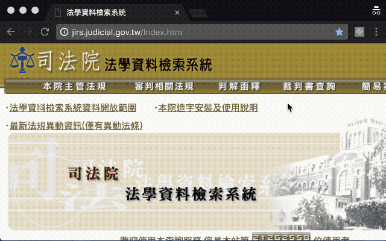

# 司法文書重排版



將司法文書系統所產生格式文字，基於語句邏輯重新進行排版，輸出純文字。

## 使用方式

- 線上版：[前往](https://lisez.github.io/rejdoc/)
- 離線版：[前往](https://github.com/lisez/rejdoc/releases/)
- Chrome擴充功能：
  - [Chrome WebApp Store](https://chrome.google.com/webstore/detail/%E5%8F%B8%E6%B3%95%E6%96%87%E6%9B%B8%E9%87%8D%E6%8E%92%E7%89%88/eegidpmlcbalnjfgklfhblhjfhhljecb?hl=zh-TW)
  - [GitHub](https://github.com/lisez/rejdoc-gc)

## 更新日誌

### v2.0.0-alpha

- 針對裁判書優化，但目前不適用所有司法文書
- 將裁判書內容輸出JSON格式

## 已知問題

- 拉丁字母間空白亦將取代
- 理由中表格未處理
    - 例：臺灣高等法院臺中分院刑事判決103年度矚上訴字第695號

## 範例文章

- 函式庫版本：2.0.1-alpha
- 裁判字號：臺灣臺北地方法院民事判決105年度訴字第3754號

### JSON

```JSON
{
    "court": "臺灣臺北地方法院民事判決",
    "court_div": "民事第二庭",
    "court_member": [
        "法官江春瑩",
        "書記官楊其康"
    ],
    "case_number": [
        "105年度訴字第3754號"
    ],
    "case_meta": [
        [
            "裁判字號",
            "105,訴,3754"
        ],
        [
            "裁判日期",
            "民國106年03月06日"
        ],
        [
            "裁判案由",
            "損害賠償等"
        ]
    ],
    "case_parities": [
        [
            "原告金溥聰",
            "訴訟代理人葉慶元律師",
            "複代理人鄭雅玲律師"
        ],
        [
            "被告馮光遠",
            "訴訟代理人張靖雅律師"
        ]
    ],
    "case_history": [],
    "fulltext": [
        "【裁判字號】105,訴,3754",
        "【裁判日期】民國106年03月06日",
        "【裁判案由】損害賠償等",
        "【裁判內文】",
        "臺灣臺北地方法院民事判決105年度訴字第3754號",
        "原告金溥聰",
        "訴訟代理人葉慶元律師",
        "複代理人鄭雅玲律師",
        "被告馮光遠",
        "訴訟代理人張靖雅律師",
        "上列當事人間請求損害賠償等事件，本院於民國106年2月6日言詞辯論終結，判決如下：",
        "主文",
        "被告應給付原告新臺幣壹拾伍萬元，及自民國一百零五年九月八日起至清償日止，按年息百分之五計算之利息。",
        "原告其餘之訴駁回。",
        "訴訟費用由被告負擔百分之十五，餘由原告負擔。",
        "本判決原告勝訴部分，於原告以新臺幣伍萬元供擔保後，得假執行；但被告如以新臺幣壹拾伍萬元為原告預供擔保，得免假執行。",
        "原告其餘假執行之聲請駁回。",
        "事實及理由",
        "壹、程序方面：\n",
        "按訴狀送達後，原告不得將原訴變更或追加他訴，但有下列各款情形之一者，不在此限：(七)不甚礙被告之防禦及訴訟之終結者，民事訴訟法第255條第1項第7款定有明文。本件原告原起訴主張被告於附表編號1至5所示時間發表如附表編號1至5所示言論，侵害原告名譽權，爰請求損害賠償；嗣於106年1月25日以民事言詞辯論意旨狀追加如附表編號6所示時間發表如附表編號6所示言論之侵權行為事實，併請求損害賠償。經核原告於言詞辯論程序前追加，無礙被告之防禦及訴訟之終結，於法自無不合，應予准許，本院爰就變更後之訴為裁判。\n",
        "貳、實體方面：\n",
        "一、原告起訴主張：被告自民國104年3月起，於如附表所示時間，發表如附表所示之言論，以「男妓」、「法院認證的男妓」、「混蛋」、「爛咖」及「下流胚」等字眼侮辱謾罵伊，已逾越法律容許言論自由之範圍，嚴重侵害伊之名譽權，致伊精神倍感痛苦，爰依民法第184條第1項前段、第195條第1項等規定提起本訴，請求被告登報道歉並賠償精神慰撫金。\n",
        "並聲明：(一)被告應給付原告新臺幣（下同）100萬元，及自起訴狀繕本送達翌日起至清償日止，按年息5%計算之利息。\n",
        "(二)被告應將附件1所示道歉聲明，按附件2所示之刊登規格及字體大小刊登於聯合報、中國時報、自由時報、蘋果日報全國版頭版各一日。(三)就聲明第(一)項部分，並願供擔保請准宣告假執行。\n",
        "二、被告則以：言論5係引用其於102年9月10日在個人部落格上發表之文章內容，業經臺灣高等法院(下稱高等法院）104年度上字第413號請求害賠償事件（下稱高等法院413號民事事件）判決在案，此部分係重複起訴；言論1至4則均係出於評論，原告前對伊多次告訴涉犯刑事加重誹謗罪嫌及起訴請求民事損害賠償，試圖打壓言論自由，卻經高等法院以103年度上易字第2515號刑事判決（下稱高等法院2515號刑事案件）認定無罪並確定在案之事實，並非針對原告個人人格為抽象謾罵；又原告憑藉與前總統馬英九之關係，影響政府預定政策，且位居與其專業、資歷顯不相當之公職，嚴重影響我國民主法治，伊使用「特殊性關係」、「男妓」等字詞，僅係評論原告與前總統馬英九以權謀私、以私害公之情。伊所發表之言論乃為監督政府，對於原告已引起社會大眾輿論批評之行為，針對公共事務進行評論，並未逾越合理評論之範疇。此外，同性戀於現今社會價值判斷中已非貶抑詞，原告縱遭誤認係同性戀，亦未減損其名譽等語，資為抗辯。並聲明：(一)原告之訴駁回。(二)如受不利判決，願供擔保請准免為假執行。\n",
        "三、原告主張被告於附表所示時間在臉書網站其個人網頁上或於報紙撰寫文章時，發表附表所示言論之事實，業據其提出被告個人網頁列印文章、自由時報自由評論網文章等為證（見本院卷第43頁正面、44頁正反面、46頁正面、48頁正面、49頁反面、51頁正面、138頁正面），且為被告所不爭執，堪信此部分事實為真實。惟原告主張被告所為附表之言論不法侵害其名譽權，應負侵權行為損害賠償責任，並應依民法第184條第1項前段、第195條第1項之規定賠償其精神慰撫金及登報道歉回復名譽等情，則為被告所否認，並以前開情詞置辯。是以本件應審究之重點厥為：(一)言論5是否係重複起訴？(二)被告所為言論1至6是否不法侵害原告之名譽權而應負侵權行為損害賠償責任？(三)如是，被告應負損害賠償責任範圍為何？茲析述如後。\n",
        "(一)、言論5是否係重複起訴？\n",
        "按訴訟標的為確定判決之效力所及者，法院應以裁定駁回原告之訴，民事訴訟法第249條第1項第7款定有明文。而訴訟法上所謂一事不再理之原則，乃指同一事件已有確定之終局判決者而言，其所謂同一事件，必同一當事人就同一法律關係而為同一之請求，若此三者有一不同，即不得謂為同一事件，自不受確定判決之拘束（最高法院19年上字第278號民事判例意旨參照）。經查，原告提起本件訴訟前，另主張被告於102年9月10日在其個人部落格上發表「老婆還沒急著先走，結果被罵，如果這不是尿急，那什麼才是尿急？」文章中載稱：「男性屬下藉著特殊性關係當上駐美代表，如果這不是男妓，那什麼才是男妓？……如果我們回顧他跟金溥聰之間的特殊性關係以及這個特殊性關係對台灣民主的傷害、羞辱，『很奇怪耶你』就都會脫口而出。」等語，有散布不實內容予不特定大眾致侵害伊名譽權之事實，依民法第184條第1項、第195條第1項規定，請求被告應負侵權行為損害賠償責任而起訴，經本院102年度訴字第4323號侵權行為損害賠償事件受理，該判決駁回原告請求後，原告不服提起上訴，經高等法院104年度上字第413號侵權行為損害賠償事件受理，並改判被告應賠償原告100萬元及於報紙刊登道歉聲明，並確定在案。而原告提起本件訴訟係主張被告於104年7月29日，在臉書網站個人網頁上發表言論5，依民法第184條第1項前段、第195條規定，請求被告應負侵權行為損害賠償責任。固言論5之內容與102年9月10日在其個人部落格上發表之內容有關「男性屬下藉著特殊性關係當上駐美代表，如果這不是男妓，那什麼才是男妓」等文字部分相符，惟兩件訴訟之侵權行為事實發生時間不同，原告主張受害之權利應為不同，是兩件訴訟之訴訟標的，未盡相同，參照前述說明，並無重複起訴之情事。準此，被告以本件訴訟言論6部分與高等法院104年度上字第413號事件屬同一事件為由，抗辯原告再提起本件訴訟，為同一事件再行起訴云云，並無可採。\n",
        "(二)、被告所為言論1至6是否不法侵害原告之名譽權而應負侵權行為損害賠償責任？如是，被告應負損害賠償責任範圍為何？\n",
        "1.按因故意或過失，不法侵害他人之權利者，負損害賠償責任，民法第184條第1項前段定有明文。名譽為個人在社會上享有一般人對其品德、聲望或信譽等所加之評價，屬於個人在社會上所受之價值判斷。民法上名譽權之侵害非即與刑法之誹謗罪相同，名譽有無受損害，應以社會上對個人評價是否貶損作為判斷之依據，苟其行為足以使他人在社會上之評價受到貶損，不論其為故意或過失，均可構成侵權行為，其行為不以廣佈於社會為必要，僅使第三人知悉其事，亦足當之（最高法院90年台上字第646號判例要旨參照）。是所謂名譽權受損，尚非單依被害人主觀之感情加以判斷，而應依社會客觀之評價判定。次按涉及侵害他人名譽之言論，可包括事實陳述與意見表達，前者有真實與否之問題，具可證明性，行為人應先為合理查證，且應以善良管理人之注意義務為具體標準，並依事件之特性分別加以考量，因行為人之職業、危害之嚴重性、被害法益之輕重、防範避免危害之代價、與公共利益之關係、資料來源之可信度、查證之難易等，而有所不同；後者乃行為人表示自己之見解或立場，屬主觀價值判斷之範疇，無真實與否可言，行為人對於可受公評之事，如係善意發表適當評論，固不具違法性，然行為人倘對於未能確定之事實，使用偏激不堪之言詞而為意見表達，足以貶損他人在社會上之評價，仍屬侵害他人之名譽權，應負侵權行為之損害賠償責任（最高法院99年度台上字第175號民事判決參照）。故行為人之言論雖損及他人名譽，惟其言論係屬真實者，或行為人有相當理由確信為真實者，倘未涉及私德而與公共利益無關者，或就可受公評之事為適當之評論者，均難謂係不法侵害他人之名譽權，自不負侵權行為損害賠償責任。再者，言論涉及公共議題，應受最大自由之保障，不但因為此類言論之自由表達，可收預防、抑制政治濫權，維護人民基本權利之功效，具有憲法上價值，為憲法第11條所明定之自由權。且借鑑近代極權國家箝制言論造成軍政濫權所衍生之災害，言論自由之保障，無疑是維護公共安全，確保人民福祉最省社會成本之方法。是涉及公共議題之言論，國家應予最大限度之維護，俾其監督各種政治社會活動之功能得以發揮，使大眾對於公共議題保有不受拘束，可充分討論之空間。至於涉及公共利益之言論若與言論對象之名譽權發生衝突，雖不可一味漠視後者之保護，然若言論對象為公眾人物，因其動靜往往牽引廣泛效應，影響公共利益深遠，如言論內容涉及高度公共性，言論對象之名譽權私益自應做最大限度之退讓，騰出批評之空間。故針對與公共利益有關且可受公評之事項，其事實客觀已明，或行為人有相當理由確信其為真實，甚或行為人主觀上未以某一事實確為真實進而指摘或傳述，其後所進行之評論，本於保障言論自由及維護公共利益之觀點，原則上仍應予保障。蓋因多元民主社會對各種價值判斷均應包容，而普受言論自由保障，並藉由言論自由市場機制，使真理越辯越明，達到去蕪存菁之效果，縱屬不留餘地或尖酸刻薄，甚至偏激非中立之意見表達，均應受保障。尤以評論對象為政府官員、公眾人物、大型企業或公益組織，因彼等掌握社會較多之權力或資源分配，言行關乎公共利益，本應受較嚴格之檢驗制衡，對於相對弱勢者之意見表達，自應以較大程度之容忍。否則，意見表達措詞稍有不慎，動輒刑罰相加，或課予賠償責任，恐將致言者噤聲，引發寒蟬效應，與極權國家箝制言論實屬無異，自與維護基本權，增進人民福祉之憲法價值相悖離，而非可取。又事實陳述與意見表達在概念上偶有流動，有時難期涇渭分明，若言論係以某項事實為基礎，或以夾論夾敘方式為之，在評價言論自由與保障個人名譽權之考量上，仍應考慮事實之真偽。是對於將事實陳述混合意見表達之評論，該評論者倘對於未能確定之事實使用偏激不堪之言詞為意見之表達，而足以貶損他人在社會上之評價，則已侵害他人之名譽權，應負侵權行為之損害賠償責任，不再屬於言論自由保障之範疇（最高法院97年度台上字第1731號判決意旨參照）。另解讀爭議之言詞時，除不得任意匿飾增刪外，應綜觀該言詞之全文，以免失真。而權衡個人名譽對言論自由之退讓程度時，於自願進入公眾領域之公眾人物，就涉及公眾事務領域之事項，應為較高程度之退讓（最高法院95年度台上字第2365號判決意旨參照）。惟關於公眾人物之私人事務，若未經其同意，將私人事務即「僅涉及私德而與公共利益無關」之未確定事實，以事實陳述混合意見表達方式為評論公開揭露於外，強令其將私領域與公共利益無關之事務廣泛公諸於世，任不特定人加以泛道德式之批評，或無謂之嘲諷，於該被害人之名譽自屬有損，難謂無不法性。\n",
        "2.經查，被告於附表所示之言論以用語「男妓」指稱原告，為被告所自認無訛（見本院卷第99頁反面），另以「混蛋」、「爛咖」、「下流胚」指摘原告，亦為被告所不爭執，而「妓」現今專指賣淫的婦女，「混蛋」指「罵人愚笨、糊塗」，「爛」指「形容人不好、差勁」，「下流」則係指「品格污下」，此有教育部重編國語辭典修訂本在卷可稽（見本院卷第53、141頁反面、142頁正、反面）。被告係以「男妓」、「混蛋」、「爛咖」及「下流胚」等用語謾罵原告，對原告為人身攻擊，尤其言論5以「男妓」指稱原告，影射原告用身體來賺取想要的利益，如同娼妓，更係以嚴重不堪之言詞侮辱上訴人，貶低原告之人格，顯然均已逾言論自由對公共事務評論之範疇，而對原告造成人格及名譽之侵害。又言論5，被告於文章內陳述：「男性屬下藉著特殊性關係當上駐美代表，如果這不是男妓，那什麼才是男妓？」、「男性屬下藉著特殊性關係當上駐美代表，…用身體來賺取想要的利益…」等語中所稱「特殊性關係」顯係指男性娼妓關係。\n",
        "原告主張被告上開言論所為「特殊性關係」之用語，係指特殊「性關係」之意，足以貶低原告之品德、聲望，減損其在社會上之評價，而侵害原告之名譽權，應屬可採。被告抗辯其用語僅為「特殊性」關係之意義，且用以影射原告與前總統馬英九為同性戀關係並無貶抑之意，並未侵害原告之名譽權，尚非可採。雖基於言論自由足以促進多元社會之發展與進步，應為憲法所保障，在傳媒上將事實陳述混合意見表達之評論，縱用語過於聳動或偏激，仍應儘量予以包容，以實現民主社會之價值。且公眾人物就涉及公眾事務領域之事項，應為較高程度之退讓。被告固係為評論原告憑藉與前總統馬英九關係密切而官運得以扶搖直上之情事，並以其個人文章之風格特色撰文批評，惟本於善良管理人之注意義務，原應注意避免使用辱罵人格之不堪言詞，並避免將涉及個人私人無關公共利益之事務廣泛公諸於世，任令不特定人加以泛道德式之批評，或無謂之嘲諷，被告疏於注意選擇適當之用語評論，以上開不堪言詞或混合不確定事實陳述就公共議題發表評論，在客觀上復足認有貶低原告人格致其在社會上之評價有所減損，應認侵害原告之名譽權，自應負過失侵權行為之損害賠償責任，而不再屬於言論自由保障之範疇。此外，被告發表如附表所示言論致原告名譽權受有損害，兩者間並有相當因果關係，被告依民法第184條第1項前段之規定，自應負侵權行為損害賠償之責。\n",
        "(三)、被告應負損害賠償責任範圍為何？\n",
        "1.按不法侵害他人之名譽，被害人雖非財產上之損害，亦得請求賠償相當之金額，並得請求回復名譽之適當處分，此觀民法第195條第1項之規定即明。又名譽被侵害者，關於非財產上之損害，加害人雖負賠償責任，但以相當之金額為限，所謂相當，自應以實際加害情形與其名譽影響是否重大，及被害者之身分地位與加害人經濟狀況等關係定之（最高法院47年台上字第1221號判例要旨參照）。查，被告於附表所示之言論，以「男妓」、「法院認證之男妓」、「混蛋」、「爛咖」及「下流胚」等用語謾罵原告，另以言論5「特殊性關係……男妓」之用語，意指特殊「性關係」，不法侵害原告之名譽權，該等貶損言論透過網路、媒體等傳送，使得廣大群眾皆得知悉，致該貶損言論廣為散布，原告名譽權所受之損害，尚非輕微，精神上必然受相當之痛苦，是原告依前揭規定請求被告賠償非財產上之損害，洵屬有據。次查，原告係45年8月30日出生，本件侵權行為發生時約59歲，學歷為國立政治大學新聞系畢業，取得美國德州理工大學大眾傳播研究所碩士及德州大學奧斯汀分校新聞研究所博士學位，曾於國內大學大眾傳播系、新聞系擔任講師或副教授之教職，另曾任臺北市政府新聞處處長、臺北市政府副市長、我國駐美代表、國家安全會議秘書長等職務，名下有坐落臺北市文山區之不動產，業經原告自承在卷可佐（見本院卷第136頁反面）。被告係42年9月23日出生，本件侵權行為發生時約62歲，學歷為輔仁大學圖書館學系學士，美國FAIRFIELDUNIVERSITY大學大眾傳播學系畢業，收入來源為寫作稿費及電視通告費，此經高等法院104年度上字第413號認定在案，並為被告所不爭執。本院審酌被告有相當智識能力，係於評論公共議題時因失慮輕率而過失為上開言論之侵權行為態樣，該行為侵害原告之名譽權致其精神上所受痛苦之情狀，並兩造前開身分地位、經濟狀況、被告之加害與原告之名譽受損情形，以及前已因相同言論而經高等法院104年度上字第413號事件認定被告應賠償原告100萬元暨登報道歉等情，認原告請求賠償精神慰撫金100萬元尚屬過高，應以15萬元為適當，原告逾此部分金額之請求，即不應准許。\n",
        "2.再按名譽被侵害者，被害人得請求回復名譽之適當處分，此觀民法第195條第1項後段規定即明。而所謂「適當處分」，係指該處分在客觀上足以回復被害人之名譽且屬必要者而言；如以判決命加害人公開道歉，而未涉及加害人自我羞辱等損及人性尊嚴之情事者，即未違背憲法第23條比例原則，而不牴觸憲法對不表意自由之保障（司法院大法官釋字第656號解釋文暨理由書參照）。故於侵害名譽事件，若為回復受害人之名譽，有限制加害人不表意自由之必要，參諸上開大法官解釋文暨理由書所闡釋之意旨，法院仍應就原告名譽權受侵害之情節輕重與強制被告表意之內容等事項，審慎斟酌而為適當之決定，非謂原告之名譽權受有損害，法院即須依原告所聲明回復名譽之方式一律准許，始符合憲法第23條所定之比例原則並兼顧雙方基本人權之維護。查，原告請求被告在聯合報、中國時報、自由時報、蘋果日報全國版頭版以如附件2所示規格及字體大小刊登道歉啟事，以為回復原告名譽之方法。惟本院審酌兩造紛爭肇因於前總統馬英九自97年5月起至105年5月止擔任我國總統，前總統馬英九卸任距今已近10月，是為避免道歉啟事登載於公眾媒體，致其餘原本未瀏覽被告臉書網站個人網頁而不知情之人，或已淡忘此事之大眾，反而重新獲悉兩造之糾紛，反無益於原告名譽之回復，復考量報紙與網站閱覽族群不同，被告1.3.4.5.6.言論僅發表於網路，原告請求被告另於報紙刊登道歉啟事，尚難認具必要性，亦非屬回復名譽之適當處分。職是，原告此部分主張即難認有徵。\n",
        "四、末按給付無確定期限者，債務人於債權人得請求給付時，經其催告而未為給付，自受催告時起，負遲延責任。其經債權人起訴而送達訴狀，或依督促程序送達支付命令，或為其他相類之行為者，與催告有同一之效力；遲延之債務，以支付金錢為標的者，債權人得請求依法定利率計算之遲延利息，民法第229條第2項、第233條第1項前段分別定有明文。又應付利息之債務，其利率未經約定，亦無法律可據者，週年利率為5%，亦為同法第203條所明定。本件原告依侵權行為法律關係請求被告負損害賠償責任，為無確定期限、無從另為約定利率之債務，是原告自得依上開規定請求被告自起訴狀繕本送達被告翌日即自105年9月8日起至清償日止，按週年利率5%計算之利息。\n",
        "五、綜上所述，本件原告主張被告發表如附表所示之言論，以上開言詞不法侵害原告之名譽權，並致原告之精神受有損害，堪以採信。是則，原告依民法第184條第1項前段、第195條第1項之規定，請求被告應給付原告15萬元，及自起訴狀繕本送達翌日即105年9月8日起至清償日止，按年息5%計算之利息，為有理由，應予准許。逾此部分之請求，為無理由，不應准許。又兩造均陳明願供擔保，聲請宣告假執行及免為假執行，經核原告勝訴部分，於法並無不合，爰分別酌定相當之擔保金額宣告之。至原告敗訴部分，其假執行之聲請已失所附麗，應併予駁回。\n",
        "六、本件事證已臻明確，兩造其餘之攻擊或防禦方法及所用之證據，經本院斟酌後，認為均不足以影響本判決之結果，爰不逐一論列，附此敘明。\n",
        "七、據上論結，本件原告之訴為一部有理由，一部無理由，依民事訴訟法第79條、第389條第1項第5款、第392條第2項，判決如主文。\n",
        "民事第二庭法官江春瑩",
        "中華民國106年3月6日以上正本係照原本作成。",
        "如對本判決上訴，須於判決送達後20日內向本院提出上訴狀。如委任律師提起上訴者，應一併繳納上訴審裁判費。",
        "書記官楊其康",
        "附表",
        "┌──┬───────────────────────┬─────┐",
        "│編號│言論內容　　　　　　　　　　　　　　　　　　　│備註　　　│",
        "├──┼───────────────────────┼─────┤",
        "│ 1　│104年3月6日，被告於臉書網站其個人網頁上公開貼 │下稱言論1 │",
        "│　　│文載稱：「經由法院認證…我們這個民主國家的駐美│　　　　　│",
        "│　　│代表，竟然是由一個『他，馬的』男妓在當，…我們│　　　　　│",
        "│　　│什麼時候聽過，有哪一個國家的國安會秘書長，是由│　　　　　│",
        "│　　│一個男妓在主導的嗎？」　　　　　　　　　　　　│　　　　　│",
        "├──┼───────────────────────┼─────┤",
        "│ 2　│104年3月23日出刊之自由時報中，被告公開發表「法│下稱言論2 │",
        "│　　│院認證男妓之真相」文章載稱：「金溥聰…成為台灣│　　　　　│",
        "│　　│第一個法院認證的男妓。一個國家的駐美代表，國安│　　　　　│",
        "│　　│會秘書長，竟然是個法院認證的男妓（male　　　　│　　　　　│",
        "│　　│prostitute)」。　　　　　　　　　　　　　　　 │　　　　　│",
        "├──┼───────────────────────┼─────┤",
        "│ 3　│104年4月13日，被告於臉書網站其個人網頁上公開貼│下稱言論3 │",
        "│　　│文載稱：「台灣第一個經法院認證的男妓」。　　　│　　　　　│",
        "├──┼───────────────────────┼─────┤",
        "│ 4　│104年7月27日，被告於臉書網站其個人網頁上公開貼│下稱言論4 │",
        "│　　│文載稱：「曾經有個叫做金溥聰的想搞我，結果他成│　　　　　│",
        "│　　│為法院認證的男妓」。　　　　　　　　　　　　　│　　　　　│",
        "├──┼───────────────────────┼─────┤",
        "│ 5　│104年7月29日，被告於臉書網站其個人網頁上公開貼│下稱言論5 │",
        "│　　│文載稱：「『男性屬下藉著特殊性關係當上駐美代表│　　　　　│",
        "│　　│，如果這不是男妓，那什麼是男妓。』…『男性屬下│　　　　　│",
        "│　　│藉著特殊性關係當上駐美代表，身體來賺取想要的利│　　　　　│",
        "│　　│益…用身體來賺取想要的利益…』」。　　　　　　│　　　　　│",
        "├──┼───────────────────────┼─────┤",
        "│ 6　│104年9月16日，被告於臉書網站其個人網頁上公開貼│下稱言論6 │",
        "│　　│文載稱：「第一號罪人，就是金溥聰這混蛋、爛咖、│　　　　　│",
        "│　　│下流胚」。　　　　　　　　　　　　　　　　　　│　　　　　│",
        "└──┴───────────────────────┴─────┘",
        "┌──────────────────────────┐",
        "│　　　　　　　　　道歉聲明　　　　　　　　　　　　　│",
        "│道歉人馮光遠屢次以「法院認證的男妓」及「男妓」等不實│",
        "│之污衊詞彙，對金溥聰先生橫加誹謗，致金溥聰先生名譽受│",
        "│到損害，在此特向金溥聰先生表達最高之歉意，並登報道歉│",
        "│。　　　　　　　　　　　　　　　　　　　　　　　　　│",
        "│　　　　　　　　　　　　　　　　道歉人：馮光遠　　　│",
        "└──────────────────────────┘",
        "┌────┬───┬──┬─────────┬─────┐",
        "│報別　　│版別　│版位│刊登規格（高×寬）│字體大小　│",
        "├────┼───┼──┼─────────┼─────┤",
        "│聯合報　│全國版│頭版│13.8×4.9（公分） │22級3號字 │",
        "├────┼───┼──┼─────────┼─────┤",
        "│中國時報│全國版│頭版│15×5（公分）　　 │22級3號字 │",
        "├────┼───┼──┼─────────┼─────┤",
        "│自由時報│全國版│頭版│4.5×9.2（公分）　│19級4號字 │",
        "├────┼───┼──┼─────────┼─────┤",
        "│蘋果日報│全國版│頭版│11.4×4.4（公分） │22級3號字 │",
        "└────┴───┴──┴─────────┴─────┘"
    ]
}
```

### 重排版

```txt
【裁判字號】105,訴,3754
【裁判日期】民國106年03月06日
【裁判案由】損害賠償等
【裁判內文】
臺灣臺北地方法院民事判決105年度訴字第3754號
原告金溥聰
訴訟代理人葉慶元律師
複代理人鄭雅玲律師
被告馮光遠
訴訟代理人張靖雅律師
上列當事人間請求損害賠償等事件，本院於民國106年2月6日言詞辯論終結，判決如下：
主文
被告應給付原告新臺幣壹拾伍萬元，及自民國一百零五年九月八日起至清償日止，按年息百分之五計算之利息。
原告其餘之訴駁回。
訴訟費用由被告負擔百分之十五，餘由原告負擔。
本判決原告勝訴部分，於原告以新臺幣伍萬元供擔保後，得假執行；但被告如以新臺幣壹拾伍萬元為原告預供擔保，得免假執行。
原告其餘假執行之聲請駁回。
事實及理由
壹、程序方面：
按訴狀送達後，原告不得將原訴變更或追加他訴，但有下列各款情形之一者，不在此限：(七)不甚礙被告之防禦及訴訟之終結者，民事訴訟法第255條第1項第7款定有明文。本件原告原起訴主張被告於附表編號1至5所示時間發表如附表編號1至5所示言論，侵害原告名譽權，爰請求損害賠償；嗣於106年1月25日以民事言詞辯論意旨狀追加如附表編號6所示時間發表如附表編號6所示言論之侵權行為事實，併請求損害賠償。經核原告於言詞辯論程序前追加，無礙被告之防禦及訴訟之終結，於法自無不合，應予准許，本院爰就變更後之訴為裁判。
貳、實體方面：
一、原告起訴主張：被告自民國104年3月起，於如附表所示時間，發表如附表所示之言論，以「男妓」、「法院認證的男妓」、「混蛋」、「爛咖」及「下流胚」等字眼侮辱謾罵伊，已逾越法律容許言論自由之範圍，嚴重侵害伊之名譽權，致伊精神倍感痛苦，爰依民法第184條第1項前段、第195條第1項等規定提起本訴，請求被告登報道歉並賠償精神慰撫金。
並聲明：(一)被告應給付原告新臺幣（下同）100萬元，及自起訴狀繕本送達翌日起至清償日止，按年息5%計算之利息。
(二)被告應將附件1所示道歉聲明，按附件2所示之刊登規格及字體大小刊登於聯合報、中國時報、自由時報、蘋果日報全國版頭版各一日。(三)就聲明第(一)項部分，並願供擔保請准宣告假執行。
二、被告則以：言論5係引用其於102年9月10日在個人部落格上發表之文章內容，業經臺灣高等法院(下稱高等法院）104年度上字第413號請求害賠償事件（下稱高等法院413號民事事件）判決在案，此部分係重複起訴；言論1至4則均係出於評論，原告前對伊多次告訴涉犯刑事加重誹謗罪嫌及起訴請求民事損害賠償，試圖打壓言論自由，卻經高等法院以103年度上易字第2515號刑事判決（下稱高等法院2515號刑事案件）認定無罪並確定在案之事實，並非針對原告個人人格為抽象謾罵；又原告憑藉與前總統馬英九之關係，影響政府預定政策，且位居與其專業、資歷顯不相當之公職，嚴重影響我國民主法治，伊使用「特殊性關係」、「男妓」等字詞，僅係評論原告與前總統馬英九以權謀私、以私害公之情。伊所發表之言論乃為監督政府，對於原告已引起社會大眾輿論批評之行為，針對公共事務進行評論，並未逾越合理評論之範疇。此外，同性戀於現今社會價值判斷中已非貶抑詞，原告縱遭誤認係同性戀，亦未減損其名譽等語，資為抗辯。並聲明：(一)原告之訴駁回。(二)如受不利判決，願供擔保請准免為假執行。
三、原告主張被告於附表所示時間在臉書網站其個人網頁上或於報紙撰寫文章時，發表附表所示言論之事實，業據其提出被告個人網頁列印文章、自由時報自由評論網文章等為證（見本院卷第43頁正面、44頁正反面、46頁正面、48頁正面、49頁反面、51頁正面、138頁正面），且為被告所不爭執，堪信此部分事實為真實。惟原告主張被告所為附表之言論不法侵害其名譽權，應負侵權行為損害賠償責任，並應依民法第184條第1項前段、第195條第1項之規定賠償其精神慰撫金及登報道歉回復名譽等情，則為被告所否認，並以前開情詞置辯。是以本件應審究之重點厥為：(一)言論5是否係重複起訴？(二)被告所為言論1至6是否不法侵害原告之名譽權而應負侵權行為損害賠償責任？(三)如是，被告應負損害賠償責任範圍為何？茲析述如後。
(一)、言論5是否係重複起訴？
按訴訟標的為確定判決之效力所及者，法院應以裁定駁回原告之訴，民事訴訟法第249條第1項第7款定有明文。而訴訟法上所謂一事不再理之原則，乃指同一事件已有確定之終局判決者而言，其所謂同一事件，必同一當事人就同一法律關係而為同一之請求，若此三者有一不同，即不得謂為同一事件，自不受確定判決之拘束（最高法院19年上字第278號民事判例意旨參照）。經查，原告提起本件訴訟前，另主張被告於102年9月10日在其個人部落格上發表「老婆還沒急著先走，結果被罵，如果這不是尿急，那什麼才是尿急？」文章中載稱：「男性屬下藉著特殊性關係當上駐美代表，如果這不是男妓，那什麼才是男妓？……如果我們回顧他跟金溥聰之間的特殊性關係以及這個特殊性關係對台灣民主的傷害、羞辱，『很奇怪耶你』就都會脫口而出。」等語，有散布不實內容予不特定大眾致侵害伊名譽權之事實，依民法第184條第1項、第195條第1項規定，請求被告應負侵權行為損害賠償責任而起訴，經本院102年度訴字第4323號侵權行為損害賠償事件受理，該判決駁回原告請求後，原告不服提起上訴，經高等法院104年度上字第413號侵權行為損害賠償事件受理，並改判被告應賠償原告100萬元及於報紙刊登道歉聲明，並確定在案。而原告提起本件訴訟係主張被告於104年7月29日，在臉書網站個人網頁上發表言論5，依民法第184條第1項前段、第195條規定，請求被告應負侵權行為損害賠償責任。固言論5之內容與102年9月10日在其個人部落格上發表之內容有關「男性屬下藉著特殊性關係當上駐美代表，如果這不是男妓，那什麼才是男妓」等文字部分相符，惟兩件訴訟之侵權行為事實發生時間不同，原告主張受害之權利應為不同，是兩件訴訟之訴訟標的，未盡相同，參照前述說明，並無重複起訴之情事。準此，被告以本件訴訟言論6部分與高等法院104年度上字第413號事件屬同一事件為由，抗辯原告再提起本件訴訟，為同一事件再行起訴云云，並無可採。
(二)、被告所為言論1至6是否不法侵害原告之名譽權而應負侵權行為損害賠償責任？如是，被告應負損害賠償責任範圍為何？
1.按因故意或過失，不法侵害他人之權利者，負損害賠償責任，民法第184條第1項前段定有明文。名譽為個人在社會上享有一般人對其品德、聲望或信譽等所加之評價，屬於個人在社會上所受之價值判斷。民法上名譽權之侵害非即與刑法之誹謗罪相同，名譽有無受損害，應以社會上對個人評價是否貶損作為判斷之依據，苟其行為足以使他人在社會上之評價受到貶損，不論其為故意或過失，均可構成侵權行為，其行為不以廣佈於社會為必要，僅使第三人知悉其事，亦足當之（最高法院90年台上字第646號判例要旨參照）。是所謂名譽權受損，尚非單依被害人主觀之感情加以判斷，而應依社會客觀之評價判定。次按涉及侵害他人名譽之言論，可包括事實陳述與意見表達，前者有真實與否之問題，具可證明性，行為人應先為合理查證，且應以善良管理人之注意義務為具體標準，並依事件之特性分別加以考量，因行為人之職業、危害之嚴重性、被害法益之輕重、防範避免危害之代價、與公共利益之關係、資料來源之可信度、查證之難易等，而有所不同；後者乃行為人表示自己之見解或立場，屬主觀價值判斷之範疇，無真實與否可言，行為人對於可受公評之事，如係善意發表適當評論，固不具違法性，然行為人倘對於未能確定之事實，使用偏激不堪之言詞而為意見表達，足以貶損他人在社會上之評價，仍屬侵害他人之名譽權，應負侵權行為之損害賠償責任（最高法院99年度台上字第175號民事判決參照）。故行為人之言論雖損及他人名譽，惟其言論係屬真實者，或行為人有相當理由確信為真實者，倘未涉及私德而與公共利益無關者，或就可受公評之事為適當之評論者，均難謂係不法侵害他人之名譽權，自不負侵權行為損害賠償責任。再者，言論涉及公共議題，應受最大自由之保障，不但因為此類言論之自由表達，可收預防、抑制政治濫權，維護人民基本權利之功效，具有憲法上價值，為憲法第11條所明定之自由權。且借鑑近代極權國家箝制言論造成軍政濫權所衍生之災害，言論自由之保障，無疑是維護公共安全，確保人民福祉最省社會成本之方法。是涉及公共議題之言論，國家應予最大限度之維護，俾其監督各種政治社會活動之功能得以發揮，使大眾對於公共議題保有不受拘束，可充分討論之空間。至於涉及公共利益之言論若與言論對象之名譽權發生衝突，雖不可一味漠視後者之保護，然若言論對象為公眾人物，因其動靜往往牽引廣泛效應，影響公共利益深遠，如言論內容涉及高度公共性，言論對象之名譽權私益自應做最大限度之退讓，騰出批評之空間。故針對與公共利益有關且可受公評之事項，其事實客觀已明，或行為人有相當理由確信其為真實，甚或行為人主觀上未以某一事實確為真實進而指摘或傳述，其後所進行之評論，本於保障言論自由及維護公共利益之觀點，原則上仍應予保障。蓋因多元民主社會對各種價值判斷均應包容，而普受言論自由保障，並藉由言論自由市場機制，使真理越辯越明，達到去蕪存菁之效果，縱屬不留餘地或尖酸刻薄，甚至偏激非中立之意見表達，均應受保障。尤以評論對象為政府官員、公眾人物、大型企業或公益組織，因彼等掌握社會較多之權力或資源分配，言行關乎公共利益，本應受較嚴格之檢驗制衡，對於相對弱勢者之意見表達，自應以較大程度之容忍。否則，意見表達措詞稍有不慎，動輒刑罰相加，或課予賠償責任，恐將致言者噤聲，引發寒蟬效應，與極權國家箝制言論實屬無異，自與維護基本權，增進人民福祉之憲法價值相悖離，而非可取。又事實陳述與意見表達在概念上偶有流動，有時難期涇渭分明，若言論係以某項事實為基礎，或以夾論夾敘方式為之，在評價言論自由與保障個人名譽權之考量上，仍應考慮事實之真偽。是對於將事實陳述混合意見表達之評論，該評論者倘對於未能確定之事實使用偏激不堪之言詞為意見之表達，而足以貶損他人在社會上之評價，則已侵害他人之名譽權，應負侵權行為之損害賠償責任，不再屬於言論自由保障之範疇（最高法院97年度台上字第1731號判決意旨參照）。另解讀爭議之言詞時，除不得任意匿飾增刪外，應綜觀該言詞之全文，以免失真。而權衡個人名譽對言論自由之退讓程度時，於自願進入公眾領域之公眾人物，就涉及公眾事務領域之事項，應為較高程度之退讓（最高法院95年度台上字第2365號判決意旨參照）。惟關於公眾人物之私人事務，若未經其同意，將私人事務即「僅涉及私德而與公共利益無關」之未確定事實，以事實陳述混合意見表達方式為評論公開揭露於外，強令其將私領域與公共利益無關之事務廣泛公諸於世，任不特定人加以泛道德式之批評，或無謂之嘲諷，於該被害人之名譽自屬有損，難謂無不法性。
2.經查，被告於附表所示之言論以用語「男妓」指稱原告，為被告所自認無訛（見本院卷第99頁反面），另以「混蛋」、「爛咖」、「下流胚」指摘原告，亦為被告所不爭執，而「妓」現今專指賣淫的婦女，「混蛋」指「罵人愚笨、糊塗」，「爛」指「形容人不好、差勁」，「下流」則係指「品格污下」，此有教育部重編國語辭典修訂本在卷可稽（見本院卷第53、141頁反面、142頁正、反面）。被告係以「男妓」、「混蛋」、「爛咖」及「下流胚」等用語謾罵原告，對原告為人身攻擊，尤其言論5以「男妓」指稱原告，影射原告用身體來賺取想要的利益，如同娼妓，更係以嚴重不堪之言詞侮辱上訴人，貶低原告之人格，顯然均已逾言論自由對公共事務評論之範疇，而對原告造成人格及名譽之侵害。又言論5，被告於文章內陳述：「男性屬下藉著特殊性關係當上駐美代表，如果這不是男妓，那什麼才是男妓？」、「男性屬下藉著特殊性關係當上駐美代表，…用身體來賺取想要的利益…」等語中所稱「特殊性關係」顯係指男性娼妓關係。
原告主張被告上開言論所為「特殊性關係」之用語，係指特殊「性關係」之意，足以貶低原告之品德、聲望，減損其在社會上之評價，而侵害原告之名譽權，應屬可採。被告抗辯其用語僅為「特殊性」關係之意義，且用以影射原告與前總統馬英九為同性戀關係並無貶抑之意，並未侵害原告之名譽權，尚非可採。雖基於言論自由足以促進多元社會之發展與進步，應為憲法所保障，在傳媒上將事實陳述混合意見表達之評論，縱用語過於聳動或偏激，仍應儘量予以包容，以實現民主社會之價值。且公眾人物就涉及公眾事務領域之事項，應為較高程度之退讓。被告固係為評論原告憑藉與前總統馬英九關係密切而官運得以扶搖直上之情事，並以其個人文章之風格特色撰文批評，惟本於善良管理人之注意義務，原應注意避免使用辱罵人格之不堪言詞，並避免將涉及個人私人無關公共利益之事務廣泛公諸於世，任令不特定人加以泛道德式之批評，或無謂之嘲諷，被告疏於注意選擇適當之用語評論，以上開不堪言詞或混合不確定事實陳述就公共議題發表評論，在客觀上復足認有貶低原告人格致其在社會上之評價有所減損，應認侵害原告之名譽權，自應負過失侵權行為之損害賠償責任，而不再屬於言論自由保障之範疇。此外，被告發表如附表所示言論致原告名譽權受有損害，兩者間並有相當因果關係，被告依民法第184條第1項前段之規定，自應負侵權行為損害賠償之責。
(三)、被告應負損害賠償責任範圍為何？
1.按不法侵害他人之名譽，被害人雖非財產上之損害，亦得請求賠償相當之金額，並得請求回復名譽之適當處分，此觀民法第195條第1項之規定即明。又名譽被侵害者，關於非財產上之損害，加害人雖負賠償責任，但以相當之金額為限，所謂相當，自應以實際加害情形與其名譽影響是否重大，及被害者之身分地位與加害人經濟狀況等關係定之（最高法院47年台上字第1221號判例要旨參照）。查，被告於附表所示之言論，以「男妓」、「法院認證之男妓」、「混蛋」、「爛咖」及「下流胚」等用語謾罵原告，另以言論5「特殊性關係……男妓」之用語，意指特殊「性關係」，不法侵害原告之名譽權，該等貶損言論透過網路、媒體等傳送，使得廣大群眾皆得知悉，致該貶損言論廣為散布，原告名譽權所受之損害，尚非輕微，精神上必然受相當之痛苦，是原告依前揭規定請求被告賠償非財產上之損害，洵屬有據。次查，原告係45年8月30日出生，本件侵權行為發生時約59歲，學歷為國立政治大學新聞系畢業，取得美國德州理工大學大眾傳播研究所碩士及德州大學奧斯汀分校新聞研究所博士學位，曾於國內大學大眾傳播系、新聞系擔任講師或副教授之教職，另曾任臺北市政府新聞處處長、臺北市政府副市長、我國駐美代表、國家安全會議秘書長等職務，名下有坐落臺北市文山區之不動產，業經原告自承在卷可佐（見本院卷第136頁反面）。被告係42年9月23日出生，本件侵權行為發生時約62歲，學歷為輔仁大學圖書館學系學士，美國FAIRFIELDUNIVERSITY大學大眾傳播學系畢業，收入來源為寫作稿費及電視通告費，此經高等法院104年度上字第413號認定在案，並為被告所不爭執。本院審酌被告有相當智識能力，係於評論公共議題時因失慮輕率而過失為上開言論之侵權行為態樣，該行為侵害原告之名譽權致其精神上所受痛苦之情狀，並兩造前開身分地位、經濟狀況、被告之加害與原告之名譽受損情形，以及前已因相同言論而經高等法院104年度上字第413號事件認定被告應賠償原告100萬元暨登報道歉等情，認原告請求賠償精神慰撫金100萬元尚屬過高，應以15萬元為適當，原告逾此部分金額之請求，即不應准許。
2.再按名譽被侵害者，被害人得請求回復名譽之適當處分，此觀民法第195條第1項後段規定即明。而所謂「適當處分」，係指該處分在客觀上足以回復被害人之名譽且屬必要者而言；如以判決命加害人公開道歉，而未涉及加害人自我羞辱等損及人性尊嚴之情事者，即未違背憲法第23條比例原則，而不牴觸憲法對不表意自由之保障（司法院大法官釋字第656號解釋文暨理由書參照）。故於侵害名譽事件，若為回復受害人之名譽，有限制加害人不表意自由之必要，參諸上開大法官解釋文暨理由書所闡釋之意旨，法院仍應就原告名譽權受侵害之情節輕重與強制被告表意之內容等事項，審慎斟酌而為適當之決定，非謂原告之名譽權受有損害，法院即須依原告所聲明回復名譽之方式一律准許，始符合憲法第23條所定之比例原則並兼顧雙方基本人權之維護。查，原告請求被告在聯合報、中國時報、自由時報、蘋果日報全國版頭版以如附件2所示規格及字體大小刊登道歉啟事，以為回復原告名譽之方法。惟本院審酌兩造紛爭肇因於前總統馬英九自97年5月起至105年5月止擔任我國總統，前總統馬英九卸任距今已近10月，是為避免道歉啟事登載於公眾媒體，致其餘原本未瀏覽被告臉書網站個人網頁而不知情之人，或已淡忘此事之大眾，反而重新獲悉兩造之糾紛，反無益於原告名譽之回復，復考量報紙與網站閱覽族群不同，被告1.3.4.5.6.言論僅發表於網路，原告請求被告另於報紙刊登道歉啟事，尚難認具必要性，亦非屬回復名譽之適當處分。職是，原告此部分主張即難認有徵。
四、末按給付無確定期限者，債務人於債權人得請求給付時，經其催告而未為給付，自受催告時起，負遲延責任。其經債權人起訴而送達訴狀，或依督促程序送達支付命令，或為其他相類之行為者，與催告有同一之效力；遲延之債務，以支付金錢為標的者，債權人得請求依法定利率計算之遲延利息，民法第229條第2項、第233條第1項前段分別定有明文。又應付利息之債務，其利率未經約定，亦無法律可據者，週年利率為5%，亦為同法第203條所明定。本件原告依侵權行為法律關係請求被告負損害賠償責任，為無確定期限、無從另為約定利率之債務，是原告自得依上開規定請求被告自起訴狀繕本送達被告翌日即自105年9月8日起至清償日止，按週年利率5%計算之利息。
五、綜上所述，本件原告主張被告發表如附表所示之言論，以上開言詞不法侵害原告之名譽權，並致原告之精神受有損害，堪以採信。是則，原告依民法第184條第1項前段、第195條第1項之規定，請求被告應給付原告15萬元，及自起訴狀繕本送達翌日即105年9月8日起至清償日止，按年息5%計算之利息，為有理由，應予准許。逾此部分之請求，為無理由，不應准許。又兩造均陳明願供擔保，聲請宣告假執行及免為假執行，經核原告勝訴部分，於法並無不合，爰分別酌定相當之擔保金額宣告之。至原告敗訴部分，其假執行之聲請已失所附麗，應併予駁回。
六、本件事證已臻明確，兩造其餘之攻擊或防禦方法及所用之證據，經本院斟酌後，認為均不足以影響本判決之結果，爰不逐一論列，附此敘明。
七、據上論結，本件原告之訴為一部有理由，一部無理由，依民事訴訟法第79條、第389條第1項第5款、第392條第2項，判決如主文。
民事第二庭法官江春瑩
中華民國106年3月6日以上正本係照原本作成。
如對本判決上訴，須於判決送達後20日內向本院提出上訴狀。如委任律師提起上訴者，應一併繳納上訴審裁判費。
書記官楊其康
附表
┌──┬───────────────────────┬─────┐
│編號│言論內容　　　　　　　　　　　　　　　　　　　│備註　　　│
├──┼───────────────────────┼─────┤
│ 1　│104年3月6日，被告於臉書網站其個人網頁上公開貼 │下稱言論1 │
│　　│文載稱：「經由法院認證…我們這個民主國家的駐美│　　　　　│
│　　│代表，竟然是由一個『他，馬的』男妓在當，…我們│　　　　　│
│　　│什麼時候聽過，有哪一個國家的國安會秘書長，是由│　　　　　│
│　　│一個男妓在主導的嗎？」　　　　　　　　　　　　│　　　　　│
├──┼───────────────────────┼─────┤
│ 2　│104年3月23日出刊之自由時報中，被告公開發表「法│下稱言論2 │
│　　│院認證男妓之真相」文章載稱：「金溥聰…成為台灣│　　　　　│
│　　│第一個法院認證的男妓。一個國家的駐美代表，國安│　　　　　│
│　　│會秘書長，竟然是個法院認證的男妓（male　　　　│　　　　　│
│　　│prostitute)」。　　　　　　　　　　　　　　　 │　　　　　│
├──┼───────────────────────┼─────┤
│ 3　│104年4月13日，被告於臉書網站其個人網頁上公開貼│下稱言論3 │
│　　│文載稱：「台灣第一個經法院認證的男妓」。　　　│　　　　　│
├──┼───────────────────────┼─────┤
│ 4　│104年7月27日，被告於臉書網站其個人網頁上公開貼│下稱言論4 │
│　　│文載稱：「曾經有個叫做金溥聰的想搞我，結果他成│　　　　　│
│　　│為法院認證的男妓」。　　　　　　　　　　　　　│　　　　　│
├──┼───────────────────────┼─────┤
│ 5　│104年7月29日，被告於臉書網站其個人網頁上公開貼│下稱言論5 │
│　　│文載稱：「『男性屬下藉著特殊性關係當上駐美代表│　　　　　│
│　　│，如果這不是男妓，那什麼是男妓。』…『男性屬下│　　　　　│
│　　│藉著特殊性關係當上駐美代表，身體來賺取想要的利│　　　　　│
│　　│益…用身體來賺取想要的利益…』」。　　　　　　│　　　　　│
├──┼───────────────────────┼─────┤
│ 6　│104年9月16日，被告於臉書網站其個人網頁上公開貼│下稱言論6 │
│　　│文載稱：「第一號罪人，就是金溥聰這混蛋、爛咖、│　　　　　│
│　　│下流胚」。　　　　　　　　　　　　　　　　　　│　　　　　│
└──┴───────────────────────┴─────┘
┌──────────────────────────┐
│　　　　　　　　　道歉聲明　　　　　　　　　　　　　│
│道歉人馮光遠屢次以「法院認證的男妓」及「男妓」等不實│
│之污衊詞彙，對金溥聰先生橫加誹謗，致金溥聰先生名譽受│
│到損害，在此特向金溥聰先生表達最高之歉意，並登報道歉│
│。　　　　　　　　　　　　　　　　　　　　　　　　　│
│　　　　　　　　　　　　　　　　道歉人：馮光遠　　　│
└──────────────────────────┘
┌────┬───┬──┬─────────┬─────┐
│報別　　│版別　│版位│刊登規格（高×寬）│字體大小　│
├────┼───┼──┼─────────┼─────┤
│聯合報　│全國版│頭版│13.8×4.9（公分） │22級3號字 │
├────┼───┼──┼─────────┼─────┤
│中國時報│全國版│頭版│15×5（公分）　　 │22級3號字 │
├────┼───┼──┼─────────┼─────┤
│自由時報│全國版│頭版│4.5×9.2（公分）　│19級4號字 │
├────┼───┼──┼─────────┼─────┤
│蘋果日報│全國版│頭版│11.4×4.4（公分） │22級3號字 │
└────┴───┴──┴─────────┴─────┘
```